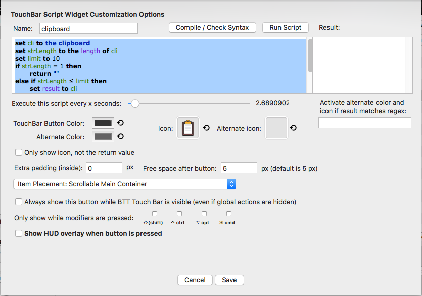

# BetterTouchTool - Clipboard - Touch Bar

## Description

If you have a MacBook Pro with the touchbar this project will help you to customize your touchbar by :
 - showing you what's in your clipboard.
 - Clear the clipboard by clicking on the widget

Example :

## Prerequisite

 - MacBook pro with the Touch Bar
 - You can read this article: [Hands-on: Creating a custom Touch Bar button using BetterTouchTool](https://9to5mac.com/2016/12/02/hands-on-custom-touch-bar-button-bettertouchtool-video/)
 - [BetterTouchTool](https://www.boastr.net/downloads/)

## Config

First, you need to add a new widget on the global section. Find the configuration below.

#### Icon

#### Script

For the widget display:

[touchbar.applescript](./touchbar.applescript)

For the action:

On the Predefined action choose **Run Applescript (enter directly as a text)**

[action.applescript](./action.applescript)

And Voila !
